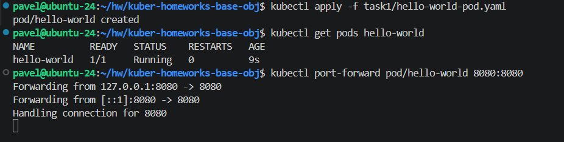
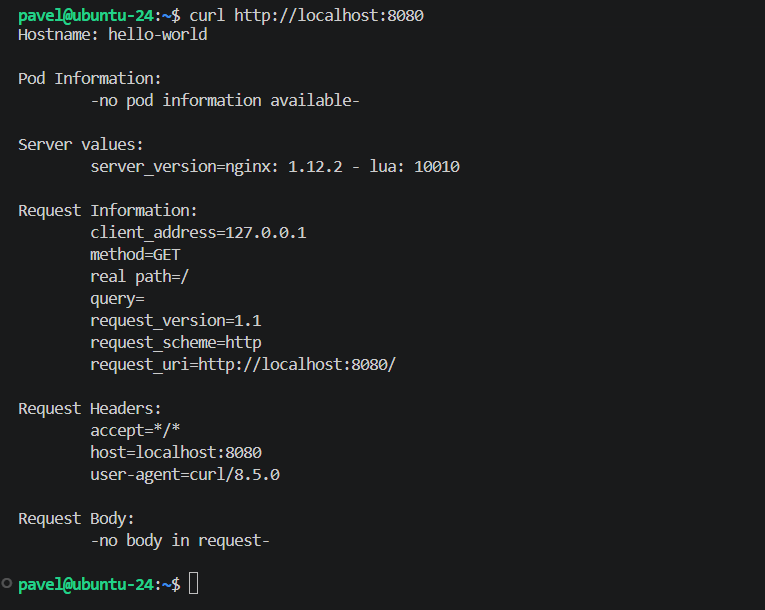
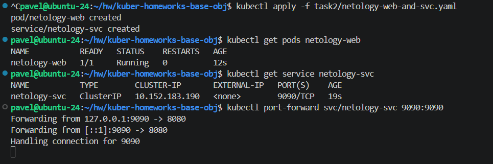
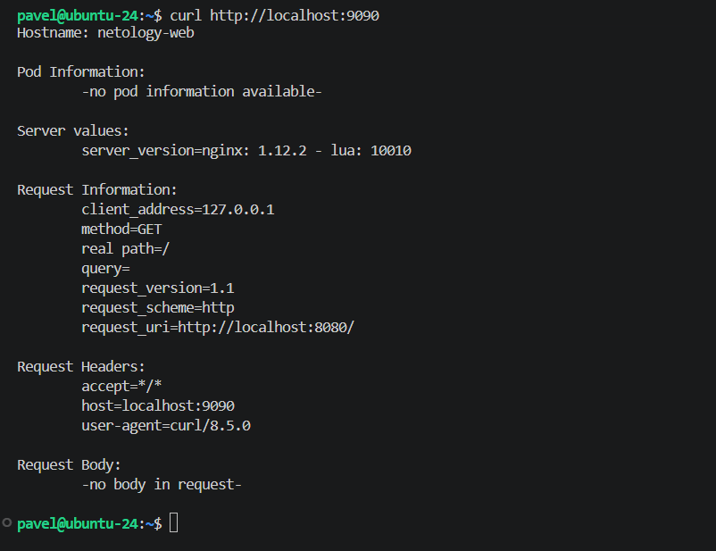

# Домашнее задание к занятию 15 «`Базовые объекты K8S`» - `Рыбянцев Павел`

------

Репозиторий содержит манифесты для создания базовых ресурсов Kubernetes (Pods, Services) и проверку их доступности.

---

## 🚀 Задание 1. Создать Pod с именем hello-world

### Инструкция по запуску:
1. Перейдите в каталог первого задания и примените манифест:
   ```bash
   kubectl apply -f task1/hello-world-pod.yaml
   ```
2. Убедитесь, что Pod перешел в статус `Running`:
   ```bash
   kubectl get pods hello-world
   ```
3. Пробросьте порт для локального тестирования:
   ```bash
   kubectl port-forward pod/hello-world 8080:8080
   ```
4. Выполните проверку в соседнем терминале или браузере:
   ```bash
   curl http://localhost:8080
   ```

### Результат выполнения:



---

## 🌐 Задание 2. Создать Service и подключить его к Pod

### Инструкция по запуску:
1. Перейдите в каталог второго задания и примените объединенный манифест Pod и Service:
   ```bash
   kubectl apply -f task2/netology-web-and-svc.yaml
   ```
2. Проверьте статус созданных ресурсов:
   ```bash
   kubectl get pods netology-web
   kubectl get service netology-svc
   ```
3. Пробросьте порт к созданному Сервису:
   ```bash
   kubectl port-forward svc/netology-svc 9090:9090
   ```
4. Выполните проверку доступности через Сервис:
   ```bash
   curl http://localhost:9090
   ```

### Результат выполнения:

